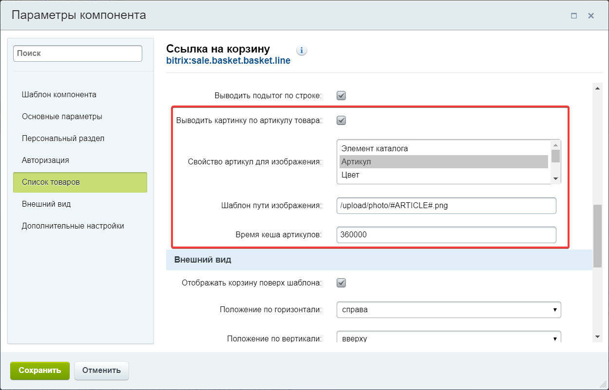

# Директория local разработанного сайта на 1C-Битрикс

### Класс обработки заказов
* Подключен через автозагрузчик Битрикса
* Метод сохранения метки utm_source в cookie 
* Метод добавления сохраненной метки в свойство UTM_SOURCE нового заказа

### Кастомизизированный шаблон компонента "Ссылка на корзину" 
* Добавлена возможность отобаржения дополнительной картики по артикулу
* Картинка берется из файла /upload/photo/{articule}.jpg 
* Использован шаблон компонента bitrix:sale.basket.basket.line из Решения [Современный интернет-магазин](https://marketplace.1c-bitrix.ru/solutions/bitrix.eshop/)
* Добавлены только модифицированные файлы

